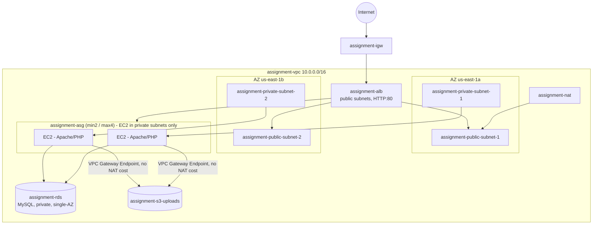
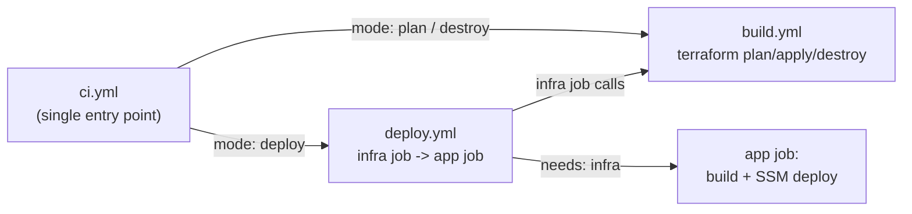
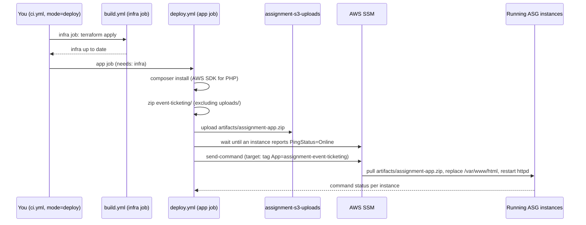

# AWS Deployment Plan — `event-ticketing`

This document is the implementation plan for deploying the [event-ticketing](../event-ticketing/) app to AWS
using Terraform + GitHub Actions. Nothing has been built yet — this is the walkthrough reference.
Account type: **AWS Academy Learner Lab** (temporary/rotating credentials, restricted IAM, $50 budget cap).
Region: **us-east-1**. Environment: single **sandbox** environment (no prod/staging).

All AWS resource names use the prefix convention `assignment-{resource}` (e.g. `assignment-vpc`,
`assignment-asg`, `assignment-rds`, `assignment-s3-uploads`).

## 1. Why "Learner Lab" changes the design

| Constraint | Impact on this plan |
|---|---|
| No custom IAM role/policy creation | Terraform **references** the existing Academy IAM role/instance profile via a `data` source instead of creating one. No GitHub OIDC federation possible. |
| Temporary credentials (`AWS_ACCESS_KEY_ID` + `AWS_SECRET_ACCESS_KEY` + `AWS_SESSION_TOKEN`) expiring every ~3-4 hrs, rotating each lab session | All 3 must be stored as GitHub Actions repo secrets, and **re-pasted before each session** you want CI/CD to run. There is no way around this with an Academy account. |
| $50 hard budget cap | Smallest sensible sizing, single NAT Gateway, `terraform destroy` between work sessions to stop hourly billing. |
| Assignment brief: RDS assumed single-AZ, HTTP-only (no TLS/custom domain required) | ALB listens on port 80 only; RDS `multi_az = false` (but the DB subnet group still needs 2 subnets in 2 AZs — that's an AWS hard requirement regardless). |

## 2. Architecture



### Security groups (deny-by-default chain)

1. `assignment-sg-alb` — inbound 80 from `0.0.0.0/0`.
2. `assignment-sg-ec2` — inbound 80 **only** from `assignment-sg-alb`; inbound 22 only from the VPC CIDR
   (EC2 has no public IP, so this is a bastion/SSM-only path, never reachable from the internet directly).
3. `assignment-sg-rds` — inbound 3306 **only** from `assignment-sg-ec2`.

No SG allows direct public reach to EC2 or RDS. The ALB is the only public entry point.

### Networking cost control

An **S3 Gateway VPC Endpoint** is attached to the private route table so image-upload traffic (and Amazon
Linux's yum repos, which are S3-backed) doesn't cost NAT data-processing fees. A single NAT Gateway still
handles other outbound traffic (OS patches, SSM agent, etc.).

### Storage & database

- `assignment-s3-uploads` — Block Public Access ON for ACLs; a bucket policy allows public `GetObject` only
  under `uploads/*` (so uploaded event photos render in-browser), no public `List`. EC2 uploads via the AWS
  SDK for PHP using its instance profile — no access keys in app code. Because S3 bucket names are globally
  unique, Terraform actually creates it as `assignment-s3-uploads-<account-id>`; the workflows and EC2
  user-data all read the real name from `terraform output`, so nothing hardcodes it.
- `assignment-rds` — MySQL, `db.t3.micro`, single-AZ, DB subnet group spanning both private subnets, not
  publicly accessible. Password generated by Terraform (`random_password`).
- `assignment-db-credentials` (**Secrets Manager**) — holds the DB host/port/name/username/password as a
  single JSON secret. EC2 instances read it at boot via their IAM role instead of any credentials being
  baked into an AMI or passed in plaintext user-data. This required granting an extra permission (below).

### Access to private EC2 instances

A bastion host is **not** the modern recommended practice for this pattern — it's another public-facing
resource to patch/secure, and AWS's own guidance favors **SSM Session Manager**, which needs zero inbound
ports and works purely off the instance's IAM role. This plan uses SSM Session Manager for shell access; the
EC2 security group's port 22 rule is scoped to the VPC CIDR only, kept as a fallback path rather than the
primary one, since the Academy LabRole commonly already includes the SSM permissions needed.

### Granting Secrets Manager access to `LabInstanceProfile`

Academy Learner Lab accounts block creating **new** IAM roles/policies, but attaching an *additional inline
policy to the existing `LabRole`* (the role behind `LabInstanceProfile`) is permitted. Terraform's `secrets`
module does this automatically:

```json
{
  "Version": "2012-10-17",
  "Statement": [
    {
      "Sid": "RetrieveDbSecret",
      "Effect": "Allow",
      "Action": "secretsmanager:GetSecretValue",
      "Resource": "<assignment-db-credentials secret ARN, computed by Terraform>"
    }
  ]
}
```

If your particular lab restricts even `iam:PutRolePolicy` on `LabRole`, this apply step will fail — in that
case this is a lab-account permission boundary, not a bug in the plan; fall back to SSM Parameter Store
(SecureString) instead, which typically doesn't need any extra grant since `LabRole` already has broad SSM
access in most Academy labs.

## 3. App code changes required (`event-ticketing`)

1. [`helpers.php`](../event-ticketing/helpers.php) — **done.** `handle_image_upload()` / `delete_image_file()`
   now upload/delete via S3 (`aws/aws-sdk-php`, using the EC2 instance role's credentials automatically - no
   access keys anywhere in the app) whenever `S3_BUCKET` is set and the SDK is installed, storing the full
   `https://<bucket>.s3.<region>.amazonaws.com/uploads/<file>` URL in `events.image_url`. If `S3_BUCKET` isn't
   set or `vendor/` doesn't exist (plain local/Docker dev, no `composer install` run), both functions fall
   back to the original local-disk behavior untouched - `entity_image_url()` renders either kind of URL. The
   app's own README previously flagged this as "deliberately not wired to S3" - this is that exercise.
   New [`composer.json`](../event-ticketing/composer.json) declares the `aws/aws-sdk-php` dependency;
   `deploy.yml`'s `composer install` step installs it before packaging.
2. [`config.php`](../event-ticketing/config.php) — no code change needed; it already reads
   `DB_HOST` / `DB_USER` / `DB_PASS` / `DB_NAME` from env vars. EC2 user-data fetches the RDS
   endpoint/password from the `assignment-db-credentials` Secrets Manager secret and exports them as Apache
   env vars, alongside `S3_BUCKET` and `AWS_REGION` for the upload code above.
3. **Done.** [`healthz.php`](../event-ticketing/healthz.php) — the ALB target group's health check
   (`health_check_path`, defaulting to `/healthz.php` in both the `alb` module and root `variables.tf`) hits
   this instead of `index.php`. It skips `require 'config.php'` (which would `die()` the whole request rather
   than fail cleanly) but does its own **timeout-bounded** DB connectivity check (3s connect timeout, well
   under the target group's 5s health check timeout) and returns `503` if the database is unreachable. This
   is a deliberate **fail-fast** choice: a booking/ticketing app is useless without its database, so an
   instance (realistically the whole fleet, since they share one RDS instance) should be reported unhealthy
   rather than keep serving broken pages. The launch template's user-data drops a matching placeholder
   `healthz.php` (alongside the placeholder `index.php`) before the first real deploy - that placeholder
   intentionally stays DB-independent (`200` unconditionally), only to avoid a chicken-and-egg failure during
   initial provisioning before RDS/networking have fully settled; the real one (shipped by `deploy.yml`)
   overwrites it with the DB-checking version above.

## 4. Terraform layout (this repo)

```
infra/
  modules/
    vpc/                # VPC, subnets, route tables, IGW, NAT, S3 gateway endpoint
    security-groups/    # assignment-sg-alb / -ec2 / -rds
    s3/                 # assignment-s3-uploads, public-read bucket policy
    secrets/            # assignment-db-credentials + IAM policy grant on LabRole
    rds/                # assignment-rds, db subnet group
    alb/                # assignment-alb, target group, HTTP:80 listener
    asg/                # launch template (+ user-data), assignment-asg, scaling policy
  envs/
    sandbox/
      backend.tf         # s3 backend: bucket=assignment-tfstate, key=sandbox/terraform.tfstate,
                         # region=us-east-1, dynamodb_table=assignment-tf-lock
      providers.tf       # terraform + aws/random provider versions
      main.tf  variables.tf  outputs.tf  terraform.tfvars
```

This has already been scaffolded in this repo — see the actual files under [`infra/`](.).

### One-time manual state bootstrap (run once, locally, before any `terraform apply`)

> **S3 bucket names are globally unique across all AWS accounts.** `assignment-tfstate` is very likely
> already taken, so pick a unique name — the commands below suffix your account ID. Use that **same** name in
> [`backend.tf`](envs/sandbox/backend.tf) (it can't use variables, so it's hardcoded there). The uploads
> bucket (`assignment-s3-uploads`) is handled automatically — Terraform suffixes the account ID for you.

```
ACCOUNT_ID=$(aws sts get-caller-identity --query Account --output text)
STATE_BUCKET="assignment-tfstate-${ACCOUNT_ID}"

aws s3api create-bucket --bucket "$STATE_BUCKET" --region us-east-1
aws s3api put-bucket-versioning --bucket "$STATE_BUCKET" --versioning-configuration Status=Enabled
aws dynamodb create-table --table-name assignment-tf-lock \
  --attribute-definitions AttributeName=LockID,AttributeType=S \
  --key-schema AttributeName=LockID,KeyType=HASH \
  --billing-mode PAY_PER_REQUEST
```

Then set `bucket = "assignment-tfstate-<your-account-id>"` in [`backend.tf`](envs/sandbox/backend.tf) to match.

## 5. GitHub Actions CI/CD

Four workflows under `.github/workflows/`, **all manual (`workflow_dispatch`) only — never triggered on
push**, so infra/app changes only ship when explicitly run. `build.yml` and `deploy.yml` are also **reusable
workflows** (`workflow_call`), chained together by `ci.yml` as the single entry point:



| Workflow | Trigger | Does |
|---|---|---|
| [`ci.yml`](../.github/workflows/ci.yml) (CI - Full Pipeline) | Manual, with a `mode` input: `plan` / `deploy` / `destroy`, plus a `ref` input (used only when `mode=deploy`) | The single entry point. `plan`/`destroy` call `build.yml` directly (infra only). `deploy` calls `deploy.yml`, which applies infra **then** deploys the app in that order (see below) — this is the button you run day to day. **`plan` never creates/changes anything** - it's a read-only preview; to actually bring resources back after a `destroy`, run `mode=deploy` (or `build.yml` with `action=apply`). |
| [`build.yml`](../.github/workflows/build.yml) (CI - Build Infrastructure) | Manual (`action` input: `plan`/`apply`/`destroy`), or called by `ci.yml`/`deploy.yml` | `terraform fmt -check`, `init`, `validate`, then the chosen action against `infra/envs/sandbox`. Infra is only ever applied from Terraform — Terraform is the single source of truth, no console click-ops. |
| [`deploy.yml`](../.github/workflows/deploy.yml) (CD - Deploy Application) | Manual (`ref` input, defaults to `main`), or called by `ci.yml` | **Job `infra`**: calls `build.yml` with `action: apply` to guarantee infrastructure exists and is current. **Job `app`** (`needs: infra`): waits for a running, SSM-managed instance (closing the gap where `terraform apply` returns before instances finish booting), then `composer install`s the AWS SDK for PHP, zips the app, uploads it to `assignment-s3-uploads/artifacts/`, and uses **SSM `send-command`** to pull the new build onto every running instance and reload Apache. See §10 for the full flow. |
| [`db-init.yml`](../.github/workflows/db-init.yml) (DB - Seed Database) | Manual, no inputs | One-time-only: runs [`schema.sql`](../event-ticketing/schema.sql) against `assignment-rds` (see §9). Safe to accidentally re-run — it skips the import if already seeded. Not wired into `ci.yml` since it's a one-off, not part of the regular deploy cycle. |

All four workflows require repo secrets:
- `AWS_ACCESS_KEY_ID`
- `AWS_SECRET_ACCESS_KEY`
- `AWS_SESSION_TOKEN`

### Why `deploy.yml` always applies infra first (the sequencing issue)

Deploying app code only makes sense against instances that already exist, are running, and are registered
with SSM. `deploy.yml` handles this with two ordering guarantees rather than assuming the previous state is
still correct:

1. **Job-level**: `app` declares `needs: infra`, so it can't start until the `infra` job (which calls
   `build.yml` with `action: apply`) has finished successfully.
2. **Step-level, inside `app`**: even after `infra` succeeds, `terraform apply` returns as soon as the AWS
   API calls succeed — not once new/replaced EC2 instances have finished booting and their SSM Agent has
   registered. The `app` job's "Wait for an SSM-managed running instance" step polls
   `aws ssm describe-instance-information` until at least one instance tagged `App=assignment-event-ticketing`
   reports `PingStatus=Online` (up to 5 minutes) before sending the actual deploy command.

Running `ci.yml` with `mode=deploy` is therefore safe to use as the everyday "ship my changes" button, even
against a cold environment that was just `apply`'d for the first time.

### Credential refresh runbook (Academy Lab specific)

Because Learner Lab credentials expire every ~3-4 hours and rotate on every new lab session, do this before
running any workflow:

1. Start the AWS Academy Learner Lab, click **AWS Details** → **Show** to reveal the temporary credentials.
2. Update the 3 GitHub secrets, e.g. via CLI:
   ```
   gh secret set AWS_ACCESS_KEY_ID -b"<value>"
   gh secret set AWS_SECRET_ACCESS_KEY -b"<value>"
   gh secret set AWS_SESSION_TOKEN -b"<value>"
   ```
3. Re-run the workflow. If a workflow fails with an auth/expired-token error mid-run, it means the session
   expired — refresh the 3 secrets and re-run.


## 6. Delivery order (mirrors the assignment's own Phase 2/3 structure — lower risk)

1. Bootstrap the state bucket + lock table (manual, §4).
2. `infra/modules/vpc` + `security-groups` → apply, verify subnets/routing.
3. `rds` + `s3` + `secrets` modules → apply, verify connectivity and secret retrieval from a temporary instance.
4. `alb` + `asg` + launch template (app bootstrap via user-data/SSM) → apply, hit the ALB DNS name.
5. Exercise `ci.yml` with `mode=plan` (then `mode=deploy`) against what's now proven manually.
6. Modify `helpers.php` for S3 uploads, then run `ci.yml` with `mode=deploy` again to ship the app.
7. Load/stress test against the ALB DNS name (assignment's "High Performing" requirement) to prove ASG
   scaling under load.

## 7. Decisions (finalized)

| Decision | Chosen |
|---|---|
| SSH access to private EC2 instances | **AWS SSM Session Manager** (no bastion — not standard practice for this pattern; port 22 kept open from the VPC CIDR only as a fallback) |
| NAT for outbound EC2 traffic | **Single NAT Gateway** (`assignment-nat`) |
| IAM role/instance profile | `LabInstanceProfile` / underlying role `LabRole` — both referenced via Terraform `data` sources, never created |
| DB secrets | **Secrets Manager** (`assignment-db-credentials`), with an inline policy granted on `LabRole` (see §2) |
| EC2/ASG instance size | `t3.micro` — change `instance_type` in [`infra/envs/sandbox/variables.tf`](envs/sandbox/variables.tf) (or `terraform.tfvars`) to resize later; no other changes needed |
| GitHub Actions triggers | `workflow_dispatch` only, on all four workflows — no auto-run on push. `ci.yml` is the day-to-day entry point; `build.yml`/`deploy.yml` double as reusable workflows it calls |

## 8. Cost & cleanup notes

- Main hourly costs: ALB (~$0.0225/hr + LCU), NAT Gateway (~$0.045/hr + data), 2x `t3.micro` EC2
  (~$0.0104/hr each), `db.t3.micro` RDS (~$0.017/hr) — all well within the $50 cap for short, active work
  sessions, but **run `build.yml` with `action: destroy` (or `terraform destroy` locally) when not actively
  working** to stop the meter between sessions.
- Terraform remote state in `assignment-tfstate` is versioned, so a `destroy` + later `apply` cycle stays
  safe and repeatable.

### What `destroy` actually cleans up (and what it deliberately doesn't)

`terraform destroy` removes the AWS resources in `infra/envs/sandbox` (VPC, ALB, ASG/EC2, RDS,
`assignment-s3-uploads`, the Secrets Manager secret, etc.) and rewrites the state file to reflect that
nothing exists anymore - it does **not** delete the state file itself, and it can't touch the
`assignment-tfstate` bucket or `assignment-tf-lock` table at all, because those were never part of this
Terraform config (they were bootstrapped manually, once, in §4, specifically so the environment's own
lifecycle can never delete the backend it depends on). The round trip is:

1. `destroy` → AWS resources gone, `sandbox/terraform.tfstate` now holds an empty resource list, the S3
   bucket/DynamoDB table are untouched.
2. Next `apply` → Terraform reads that empty state, sees nothing exists, creates everything fresh, and
   writes the new state back to the same bucket/key. No conflict, no manual cleanup needed.

`assignment-tf-lock` (DynamoDB) is a **lock**, not a status tracker - each `plan`/`apply`/`destroy` holds a
lock item for the duration of the run so two runs (e.g. you locally + a GitHub Actions run) can't write to
the state file at the same time and corrupt it. It plays no role in tracking infrastructure health.

One real gotcha this raised: `aws_s3_bucket.uploads` needed `force_destroy = true` (now set in
[`infra/modules/s3/main.tf`](modules/s3/main.tf)). AWS refuses to delete a non-empty bucket, and by the time
you run `destroy`, `assignment-s3-uploads` will contain uploaded event images, `deploy.yml`'s release
artifacts, and `db-init.yml`'s `schema.sql`/`seed-db.sh` - without `force_destroy`, `destroy` would fail
partway through on that resource, and you'd need to run `db-init.yml` again after the next `apply` regardless
since it's a fresh RDS instance anyway.

### Do you need to clean up `assignment-tfstate`/`assignment-tf-lock` yourself between rounds? No.

**Never destroy the state bucket/lock table as part of your normal destroy → apply cycle.** They're designed
to outlive every environment `destroy`, precisely so the *next* `apply` has somewhere to read/write state
from without you re-bootstrapping anything. Treat them the same as your AWS account itself: set up once,
left alone for the entire project.

- Round-tripping `destroy` then `apply` again next session works with **zero** extra setup - the bucket and
  table from §4 are still sitting there, `backend.tf` still points at them, `apply` just writes a fresh state
  into the same key.
- The **only** time you'd ever delete them is a final, one-off teardown once you're completely done with the
  assignment (e.g. after grading) and never plan to `apply` this environment again:
  ```
  aws s3 rm s3://assignment-tfstate-<your-account-id> --recursive
  aws s3api delete-bucket --bucket assignment-tfstate-<your-account-id> --region us-east-1
  aws dynamodb delete-table --table-name assignment-tf-lock
  ```
  Run this only *after* a successful `terraform destroy` of `infra/envs/sandbox` - deleting the bucket first
  would strand that environment's state with no backend to read it from.

## 9. Seeding the database (first time only)

[`schema.sql`](../event-ticketing/schema.sql) does `CREATE DATABASE`, `CREATE TABLE`, and seed `INSERT`s in
one script with no `IF NOT EXISTS` guards on the seed rows — running it twice against the same DB would
fail (duplicate key on `users.email`) or duplicate rows. RDS is also private, so nothing outside the VPC
(including a GitHub Actions runner) can reach it directly to run the script.

`db-init.yml` solves both problems:

1. Uploads `schema.sql` and [`infra/scripts/seed-db.sh`](scripts/seed-db.sh) to `assignment-s3-uploads`.
2. Picks one currently-running app instance (found by its `App` tag) and uses **SSM Run Command** to have
   *that instance* (which already sits inside the VPC, next to RDS) download and execute `seed-db.sh`.
3. `seed-db.sh` fetches DB credentials from the `assignment-db-credentials` Secrets Manager secret, checks
   whether `event_ticketing_db.users` already exists, and only imports `schema.sql` if it doesn't.

**To seed for the first time:** after `ci.yml` (`mode=deploy`, or `build.yml` `action=apply` directly) has
finished and at least one ASG instance is `running`/healthy, run `db-init.yml` once from the Actions tab.
Re-running it later (e.g. by mistake) is a harmless no-op.

## 10. Deploying application code changes

There is no auto-deploy on push — deployment is manual (`workflow_dispatch`) by design, so a code change
only reaches EC2 when you explicitly run `ci.yml` with `mode=deploy` (optionally targeting a specific
branch/tag/commit via the `ref` input). `ci.yml` calls `deploy.yml`, which always applies infra first and
only then deploys the app code (see §5's sequencing note). What happens when you run it:



A few things worth calling out:

- **Every currently-running instance is updated in place** (mutable deployment) — no new instances are
  launched for a deploy, so it's fast and doesn't touch the ASG/launch template.
- **New instances self-heal to the latest deploy automatically.** If the ASG scales out, replaces an
  unhealthy instance, or you re-`apply` Terraform after a `destroy`, the launch template's user-data
  (`infra/modules/asg/templates/user_data.sh.tftpl`) checks whether `artifacts/assignment-app.zip` already
  exists in S3 and, if so, pulls and extracts it at boot — the same artifact `deploy.yml` last uploaded. Only
  a genuinely fresh environment (nothing ever deployed) falls back to the placeholder page. This means you
  don't need to re-run the app deploy after every scaling event, only when the *code* changes.
- **Image uploads in `event-ticketing/uploads/` are intentionally excluded** from the deploy zip — with the
  S3 upload change (§3), those live in `assignment-s3-uploads` instead, not on the instance's local disk.
